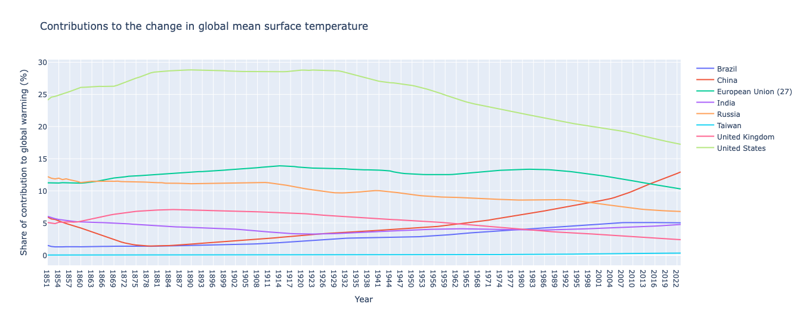
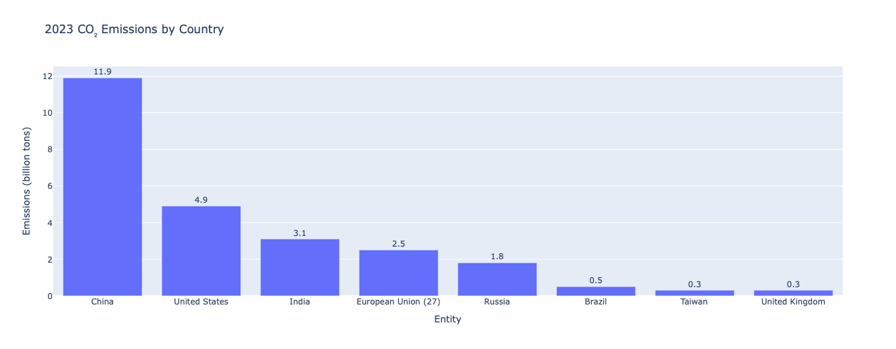
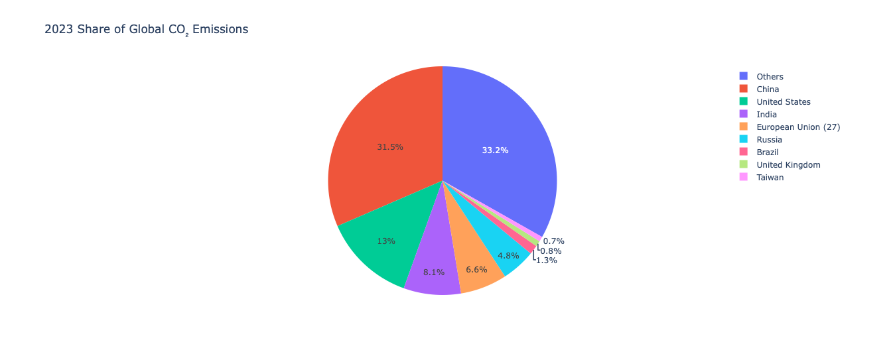
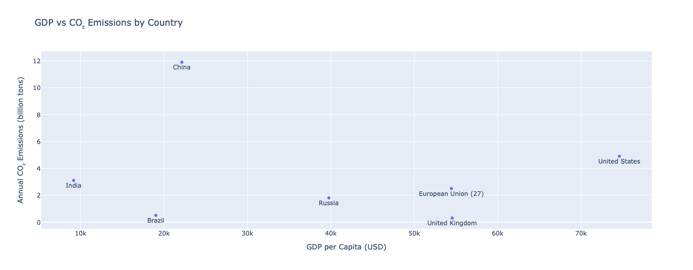
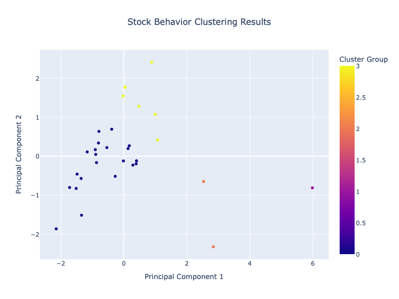

# Programming Language
* 姓名：黃靖媛
* 授課教師: 蔡芸琤老師

## Homework
### HW1
* [Coding](HW1/HW1.ipynb)

This program automatically generates travel itineraries for the Greater Taipei area. By entering the number of travel days (1–5), users receive optimized daily schedules tailored to attraction types and locations.

### HW2
* [Coding](HW2/HW2.ipynb)
* **Chart 1: Contributions to the Change in Global Mean Surface Temperature (1850–2023)**  
  This line chart illustrates the percentage contributions of major countries to global mean surface temperature change from 1850 to 2023. It reflects long-term trends in global warming responsibility. In recent years, the United States’ contribution has declined to 17.24% in 2023. Meanwhile, China’s share has steadily increased, reaching 12.94%, making it the second-largest contributor.

* **Chart 2 & 3: 2023 CO₂ Emissions by Country (Bar Chart and Pie Chart)**  
  These charts present both the total CO₂ emissions and each country's share in 2023. China is the largest emitter with 11.9 billion tons, followed by the U.S. (4.9 billion tons) and India (3.1 billion tons). The pie chart shows their respective global shares: China (31.5%), the U.S. (13%), and India (8.1%). Together, these three countries account for over half of global emissions, highlighting the disproportionate impact of a few nations.

* **Chart 4: Scatter Plot – GDP vs CO₂ Emissions by Country**  
  This chart explores the relationship between GDP per capita and total annual CO₂ emissions. The United States shows high GDP per capita with substantial emissions. China, despite lower GDP per capita, has the highest total emissions. India, with low GDP per capita, also emits a significant amount. The chart suggests that both economic output and population size influence emissions, not just wealth alone.

### HW3
* [Coding](HW3/HW3.ipynb)

- **KMeans Analysis**

  **1. Cluster 0 - Aggressive**  
    - Location: Upper‑right
    - Stocks here score high on both PCA1 and PCA2, meaning they offer high returns and strong risk‑adjusted performance (Sharpe) but come with large price swings and high trading volume.  
    - Examples: NaN  
    - Investor fit: Those willing to tolerate big ups and downs for the chance of outsized gains.

  **2. Cluster 1 - Defensive**  
    - Positioned in the bottom‑left, these stocks exhibit low returns, low volatility, low Sharpe, and low volume—characteristics of stable, capital‑preserving investments.  
    - Examples: KO, JNJ  
    - Investor fit: Risk‑averse investors seeking minimal price fluctuation.

  **3. Cluster 2 - Balanced**  
    - Found in the lower‑right quadrant: high risk‑adjusted returns (PCA1) paired with moderate‑to‑low volatility and volume.  
    - Examples: AAPL, AMZN  
    - Investor fit: Those seeking a middle ground—solid returns without extreme risk.

  **4. Cluster 3 - Speculative**  
    - In the upper‑left, these stocks have high volatility and trading activity (PCA2) but only average returns and Sharpe.  
    - Examples: NFLX, GME  
    - Investor fit: Short‑term traders or speculators looking to capitalize on volatility rather than steady performance.

## Final Project--ResuAI 智慧履歷分析平台
* [第一次提案審查](https://youtu.be/wCUb0VOu1YE)

