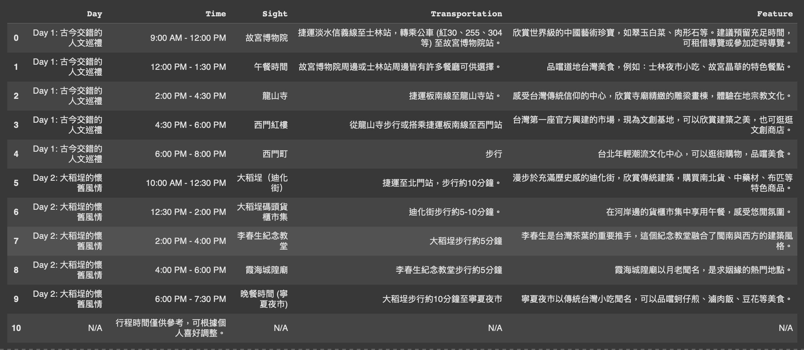

# Programming Language
* 姓名：黃靖媛
* 授課教師: 蔡芸琤老師

## Homework
### HW1
* [Coding](HW1/HW1.ipynb)

This program automatically generates travel itineraries for the Greater Taipei area. By entering the number of travel days (1–5), users receive optimized daily schedules tailored to attraction types and locations.

