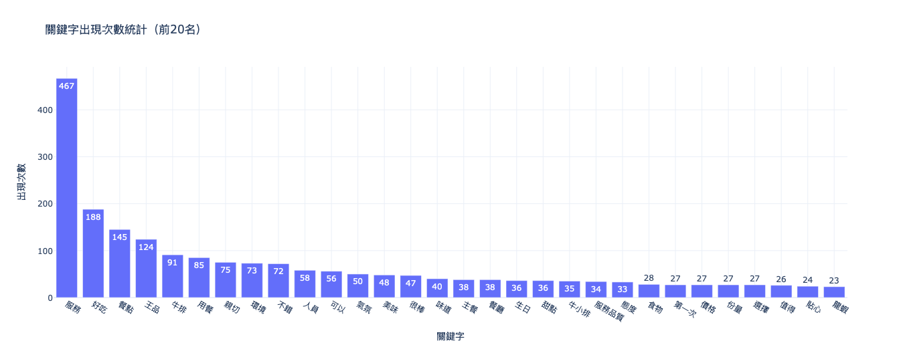
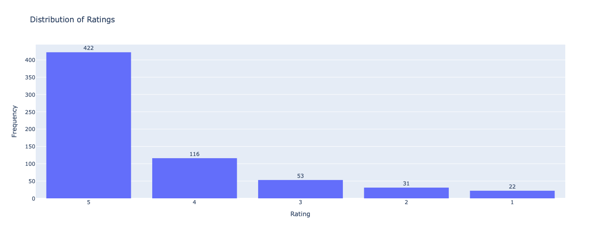
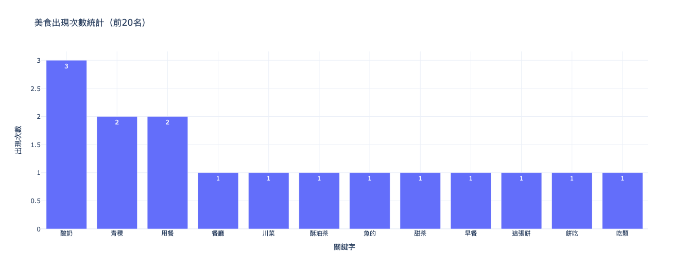

# Programming Language
* 姓名：黃靖媛
* 授課教師: 蔡芸琤老師


## Final Project--ResuAI 智慧履歷分析平台
This project is a résumé analysis platform that leverages natural language processing (NLP) technology to match keywords and evaluate résumé attributes based on the user's uploaded résumé and job description. It generates a quantitative recommendation report through automated analysis, helping job seekers identify the strengths and weaknesses of their résumés. This improves alignment with job requirements and increases the likelihood of securing an interview.
* [第一次提案審查](https://youtu.be/wCUb0VOu1YE)
* [第二次進度追蹤](https://youtu.be/zucZ3Vr_WPc)
* [期末專題成果](https://youtu.be/VdGhTAT_lLw)


* [app.py](Final_Project/app.py)


### Features
📌 Automatically matches résumés with job descriptions, providing analysis of both hard and soft skill alignment
📊 Visualizes résumé content to display the types and distribution of experiences
⚡ Real-time interactive interface with user-friendly experience
📝 One-click generation of a comprehensive recommendation report to guide résumé optimization

### Directory Structure
```text
project/
├── app.py
└── utils/
    ├── pdf_reader.py
    ├── keyword_matcher.py
    ├── visualize_result.py
    ├── resume_analyzer.py
    └── comprehensive_suggestion.py
```


***


## Homework
### HW1
* [Coding](HW1/HW1.ipynb)


This program automatically generates travel itineraries for the Greater Taipei area. By entering the number of travel days (1–5), users receive optimized daily schedules tailored to attraction types and locations.

### HW2
* [Coding](HW2/HW2.ipynb)
* **Chart 1: Contributions to the Change in Global Mean Surface Temperature (1850–2023)**  

  This line chart illustrates the percentage contributions of major countries to global mean surface temperature change from 1850 to 2023. It reflects long-term trends in global warming responsibility. In recent years, the United States’ contribution has declined to 17.24% in 2023. Meanwhile, China’s share has steadily increased, reaching 12.94%, making it the second-largest contributor.


* **Chart 2 & 3: 2023 CO₂ Emissions by Country (Bar Chart and Pie Chart)**  

  These charts present both the total CO₂ emissions and each country's share in 2023. China is the largest emitter with 11.9 billion tons, followed by the U.S. (4.9 billion tons) and India (3.1 billion tons). The pie chart shows their respective global shares: China (31.5%), the U.S. (13%), and India (8.1%). Together, these three countries account for over half of global emissions, highlighting the disproportionate impact of a few nations.


* **Chart 4: Scatter Plot – GDP vs CO₂ Emissions by Country**  

  This chart explores the relationship between GDP per capita and total annual CO₂ emissions. The United States shows high GDP per capita with substantial emissions. China, despite lower GDP per capita, has the highest total emissions. India, with low GDP per capita, also emits a significant amount. The chart suggests that both economic output and population size influence emissions, not just wealth alone.


### HW3
* [Coding](HW3/HW3.ipynb)


- **KMeans Analysis**

  **1. Cluster 0** (Upper‑right)  
    - Stocks here score high on both PCA1 and PCA2, meaning they offer high returns and strong risk‑adjusted performance (Sharpe) but come with large price swings and high trading volume.  
    - Examples: NaN
    - Suggested Investment Style: Aggresive (high‑risk, high‑reward)
    - Investor fit: Those willing to tolerate big ups and downs for the chance of outsized gains.

  **2. Cluster 1** (Lower‑left)  
    - These stocks exhibit low returns, low volatility, low Sharpe, and low volume—characteristics of stable, capital‑preserving investments.  
    - Examples: JNJ, UNH
    - Suggested Investment Style: Defensive (low‑risk, stable)
    - Investor fit: Risk‑averse investors seeking minimal price fluctuation.

  **3. Cluster 2** (Lower‑right)  
    - High risk‑adjusted returns (PCA1) paired with moderate‑to‑low volatility and volume.  
    - Examples: NVDA, TSLA, AVGO
    - Suggested Investment Style: Balanced (controlled risk, good return)
    - Investor fit: Those seeking a middle ground—solid returns without extreme risk.

  **4. Cluster 3** (Upper‑left)  
    - These stocks have high volatility and trading activity (PCA2) but only average returns and Sharpe.  
    - Examples: WMT, COST, TMUS
    - Suggested Investment Style: Speculative (high‑volatility plays)
    - Investor fit: Short‑term traders or speculators looking to capitalize on volatility rather than steady performance.

- **Patterns Across PCA Dimensions**
  - PCA1 captures risk-adjusted return (Sharpe) and overall return, while PCA2 reflects volatility and trading volume.
  - Cluster positions in the PCA space help interpret trade-offs: Clusters in the right half lean toward better returns, while those in the upper half show more volatility.

- **Potential Investment Applications**
  - **Portfolio construction:** These clusters can guide allocation strategies—e.g., balancing Cluster 2 (balanced growth) with Cluster 1 (defensive stability).
  - **Risk segmentation:** Traders can focus on Cluster 3 for volatility plays, while long-term investors avoid it due to inconsistent performance.
  - **Strategy matching:** The PCA+KMeans combo helps align stock selection with investor profiles more systematically than traditional sorting.

- **Conclusion**  

  The KMeans clustering successfully grouped stocks into four distinct investment styles—aggressive, defensive, balanced, and speculative. Each cluster shows clear differences in return, volatility, and risk-adjusted performance. These insights can help investors match their risk preferences with the right stock group and build more targeted, diversified portfolios.


### HW4
* [Coding](HW4/HW4.ipynb)
* Based on the word cloud and frequency chart, the term **「服務」** stands out with 467 mentions, indicating that customers highly value the overall service experience. Other frequently mentioned words like **「好吃」,「餐點」, 「牛排」, and 「甜點」** suggest that food quality is a major focus in customer reviews.
* The frequent appearance of terms such as **「牛小排」** implies that the restaurant may be part of the Wang Steak group or that these are popular signature items among diners.
* Words conveying emotion—such as **「親切」,「不錯」,「美味」, and 「很棒」**—are mostly positive, indicating that most customers had a satisfying or even delightful dining experience.




* Based on customer feedback and word frequency analysis, here are some personalized recommendations for the restaurant from Gemini:
```python
## 餐廳顧客評論摘要與情緒分析

**摘要重點：**

*   **正面評價：**
    *   **服務優良:** 這是顧客評論中提及次數最多的優點，包含服務態度好、親切、貼心、周到、用心、有禮貌、快速、專業等。許多顧客對服務人員的個別表現表示讚賞 (例如：劉康鴻先生、孟婷等)。
    *   **餐點美味：** 許多顧客認為餐點好吃、美味、精緻、有水準，特別是牛排、甜點、湯品等。部分顧客提及特定餐點值得推薦 (例如：王品牛小排、犢牛肋排、法式牛尾清湯等)。
    *   **用餐環境佳：** 許多顧客稱讚餐廳的環境舒適、乾淨、整潔、優雅、有氣氛、燈光美、安靜等。
    *   **適合慶祝：** 許多顧客認為餐廳適合慶生、約會、家庭聚餐等特殊場合。
*   **負面評價：**
    *   **餐點品質不穩定：** 有部分顧客覺得餐點品質下降、不如以往，例如牛排過老、過柴、有筋、太油，龍蝦肉質過硬、不新鮮，湯品過鹹、過冷，海鮮清湯味道普通，甜點表現不佳等。
    *   **價格與價值不符：** 有部分顧客認為餐點價格偏高，但品質和份量未達期望，CP值不高。
    *   **服務細節不足：** 有部分顧客提到服務細節有待加強，例如上餐速度慢、對特殊需求 (如生日優惠、過敏) 的主動告知不足、桌面清理不夠、未及時續杯等。
    *   **環境問題：** 有部分顧客反映餐廳空調位置不佳、蚊蟲多、座位擁擠、隔音差、停車不便等。

**情緒表現分析：**

*   **正面情緒：** 滿意、開心、愉悅、感謝、讚賞、推薦。
*   **負面情緒：** 失望、不滿、生氣、氣憤、抱怨、不推薦。

**最多人提到的情緒或問題：**

1.  **服務品質下降：** 雖然多數顧客仍讚賞服務，但負面評論中，服務細節不足、服務人員不夠主動積極、處理問題不夠完善等情況被頻繁提及。
2.  **餐點品質不穩定：** 部分顧客反映餐點品質不一致，曾有餐點不新鮮、烹調不當、味道普通等情況發生，未能達到與價格相符的期待。
3.  **價格高昂但體驗不符：** 許多顧客認為王品的價格偏高，但餐點品質、服務細節、環境等方面未能提供相應的高價值體驗。

**具體改善建議：**

1.  **加強服務人員培訓：**
    *   **提升主動性和敏感度：** 訓練服務人員主動觀察顧客需求，例如主動詢問特殊節日需求、及時提供餐巾擋湯汁等。
    *   **提升應變能力：** 加強服務人員處理突發狀況的能力，例如餐點問題、環境問題等，並提供明確的處理流程和補償方案。
    *   **提升產品知識：** 確保服務人員對菜單內容、優惠活動、食材特性等有充分了解，能提供準確的資訊。
    *   **提升服務熱忱：** 鼓勵服務人員展現發自內心的服務態度，讓顧客感受到溫暖和親切。
2.  **強化餐點品質管控：**
    *   **嚴格把關食材品質：** 確保食材新鮮、品質穩定，避免使用過期或品質不佳的食材。
    *   **標準化烹調流程：** 制定明確的烹調標準，確保每道餐點的品質一致，避免過老、過柴等情況發生。
    *   **優化菜單設計：** 重新審視菜單，調整不符顧客口味或缺乏特色的餐點，增加新菜色或調整烹調方式。
    *   **重視顧客反饋：** 建立有效的反饋機制，收集顧客對餐點的意見，並及時進行改進。
3.  **提升顧客體驗價值：**
    *   **改善用餐環境：** 定期維護餐廳環境，解決空調、蚊蟲、擁擠、隔音等問題，提供更舒適的用餐體驗。
    *   **提供更多停車選擇：** 與更多停車場合作，提供更多停車優惠，或提供代客泊車等服務，解決停車不便的問題。
    *   **優化甜點和麵包：** 重視甜點的品質和口味，並提升餐前麵包的品質和選擇，提供更多驚喜和美味。

總之，王品需要正視顧客對服務品質、餐點品質和價值體驗的疑慮，並採取具體措施進行改善，才能維持品牌形象和顧客忠誠度。
```


### HW5
* [Coding](HW5/HW5.ipynb)
* **Why did I choose this dataset and theme for the NER analysis?**    
  I chose this travel article as the data source because it reflects most blog posts online—content-rich but poorly structured with scattered information. By applying word segmentation and named entity recognition (NER), I reorganized the article into clear categories like “Attractions,” “Food," “Transportation,” and "feelings" helping readers quickly grasp key points. If scaled—such as by using web crawlers to gather large volumes of travel content—this method could automatically generate summaries, significantly reducing the time needed for trip planning and improving information retrieval efficiency.



* The statistical results show that local delicacies like **酸奶** and **青稞** (a traditional dish) are mentioned frequently, indicating the author’s strong focus on and interest in local cuisine. The word cloud also highlights the frequent use of positive terms such as **幸福**," **不可思議**, and **快樂** suggesting that the overall trip was a pleasant and emotionally positive experience.

* Based on the full article and NER analysis, here are some recommendations for visitors from Gemini:
```python
好的，根據文章內容，以下是總結、結論以及給有意前往西藏旅遊的遊客的建議和注意事項：

**文章總結：**

這篇文章是一位台灣遊客分享她前往西藏旅遊的經歷。旅程主要包括搭乘青藏鐵路前往拉薩，遊覽布達拉宮等著名景點，以及前往日喀則地區的絨布寺和珠峰大本營。作者詳細描述了旅途中的所見所聞，包括壯麗的自然風光、獨特的人文風情，以及高原反應帶來的挑戰。她也分享了搭乘青藏鐵路、購買車票、在西藏的交通方式，以及在高原地區的飲食、住宿等方面的經驗。

**結論：**

西藏之旅充滿了令人難以置信的體驗，但也伴隨著高原反應等挑戰。儘管存在一些限制（如台灣遊客無法自助旅行、需要辦理入藏函等），但透過旅行社的安排，依然可以欣賞到西藏獨特的自然風光和文化。

**給有意前往西藏旅遊的遊客的建議和注意事項：**

*   **行程規劃：**
    *   **提前預訂：** 青藏鐵路車票對台灣遊客有購買限制，且西藏不允許自助旅行，務必提前透過旅行社預訂行程、車票及辦理入藏函。
    *   **交通考量：** 前往西藏的交通方式多樣，包括飛機和火車。火車雖然耗時較長（例如，44 小時），但可以逐漸適應海拔高度。
    *   **行程安排：** 西藏的景點分散，建議規劃至少十天以上的行程，以便充分體驗各地的風光。
*   **健康與安全：**
    *   **高原反應：** 高原反應是西藏旅遊的主要挑戰。建議提前諮詢醫生，準備相關藥物（例如，高原康）。在旅途中注意放慢節奏，避免過度勞累，並隨時補充水分。
    *   **身體狀況：** 出發前評估自己的身體狀況，確保適合前往高海拔地區。
    *   **緊急應對：** 了解高原反應的症狀和應對方法，並與導遊保持密切聯繫。
*   **生活與文化：**
    *   **住宿條件：** 西藏的住宿條件相對簡樸，特別是在偏遠地區（如珠峰大本營）。要有心理準備，可能無法每天洗澡，且住宿環境較為簡陋。
    *   **飲食習慣：** 西藏的飲食以藏餐為主，如糌粑、酥油茶等。可以嘗試當地特色美食，但也要注意飲食衛生，避免腸胃不適。
    *   **尊重文化：** 尊重當地的宗教信仰和風俗習慣。在寺廟等宗教場所，注意言行舉止，並聽從導遊的指示。
*   **其他建議：**
    *   **衣物準備：** 西藏的氣候多變，早晚溫差大。建議攜帶保暖衣物（如羽絨服）、防曬用品（如帽子、太陽眼鏡、防曬霜）以及雨具。
    *   **現金準備：** 在西藏，行動支付的普及度可能不如其他地區。建議攜帶足夠的現金，以應付交通、餐飲和購物等需求。
    *   **通訊：** 購買當地的 SIM 卡，以便隨時保持聯繫。
    *   **明信片：** 珠峰大本營有世界最高的郵局，可以寄送具有特殊意義的明信片。
    *   **攝影：** 西藏的自然風光非常適合攝影。準備好相機和足夠的儲存空間，記錄下美好的瞬間。

希望這些建議能幫助您更好地規劃西藏之旅！
```

* **Challenges and Insights from Word Segmentation and NER Analysis**    
  One of the main challenges in word segmentation and NER is classification ambiguity. Some terms can belong to different categories depending on the context—for example, “station” might refer to a tourist attraction or a mode of transportation. To address this, I believe more rigorous classification criteria are necessary. In the future, exploring additional text mining tools could help improve both the accuracy and consistency of the classification process.
